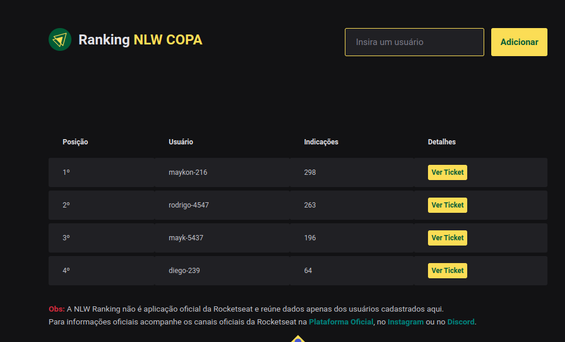

# Nome do projeto

<!---Esses são exemplos. Veja https://shields.io para outras pessoas ou para personalizar este conjunto de escudos. Você pode querer incluir dependências, status do projeto e informações de licença aqui--->



  
  <br>

> Como nesta edição do NLW a Rocketseat lançou uma premiação para os alunos que mais indicarem outros alunos para fazer o treinamento, desenvolvi essa aplicação para que pudéssemos monitorar o nosso desempenho em relaçao a outros alunos cadastrados

## TODO - Ajustes e Melhorias

Alguns bugs durante a semana levantaram a necessidade de algumas melhorias

- [ ] Guardar no banco de dados o número de indicações de cada usuário e deixar um botão para atualizar ao invés de buscar esse dado da api da Rocket a cada acesso
- [ ] Implementar testes unitários
- [ ] Refatorar o código para obdecer regras do eslint ignoradas durante o desenvolvimento
- [ ] Implementar login para permitir que usuário possa excluir o próprio registro
- [ ] Implementar paginação
- [ ] Criar documentação swagger
- [ ] Criar layout no figma

## 💻 Pré-requisitos

- Você precisa ter o Node instalado na versão LTS
- Você precisa do Insominia para testar as rotas.
- Você precisa do Dbeaver para visualizar o banco de dados.
- Você precisa clonar o projeto com o comando  
  `git clone http://github.com/maykonsousa/NLWRanking.git`

## 🚀 Instalando o Backend

Para instalar o Servidor, siga estas etapas:

1 Acesse a pasta SERVER no projeto no terminal e rode o comando:

```typescript
npm install
```

2 crie um arquivo do tipo .env com o seguinte conteúdo

```typescript
DATABASE_URL="aqui vai a url do seu banco de dados"
```

O prisma orm está configurado para um banco de dados postgress, caso queira usar outro banco de dados como MySQL ou SQLite faça as alterações necessárias de acordo com a documentação do `Prisma`

inicie o banco de dados com o comando

```typescript
npx prisma migrate dev
```

inicie o servidor na porta `3333` utilizando o comando

```typescript
npm run dev
```

## 🚀 Instalando o Front-End

Para instalar o Front-|End, siga estas etapas:

1 Acesse a pasta WEB no projeto no terminal e rode o comando:

```typescript
npm install
```

2 crie um arquivo do tipo .env com o seguinte conteúdo

```typescript
API_URL="http://localhost:3333"
```

Para funcionar é necessário que o servidor já esteja rodando na porta `3333`

inicie o servidor na porta `3000` utilizando o comando

```typescript
npm run dev
```

## ☕ Usando NLW Ranking

Para usar o NLW Raking garanta que as duas aplicações estejam rodando em suas respectivas portas e acesse a url `http://localhost:3000`

Importante: Para cadastrar um usuário é necessário que a API da Rocketseat `https://skylab-api.rocketseat.com.br/public/event/nlw-copa/referral/:userId` ainda esteja funcionando e o userId passado seja um usuário válido. por exemplo, no meu caso o usuário é `maykon-216`

[⬆ Voltar ao topo](#nome-do-projeto)<br>
